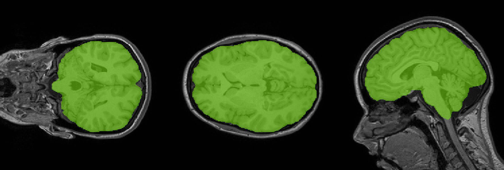

# DeepBrain

[](https://pypi.org/project/deepbrain/)


> Brain image processing tools using Deep Learning focused on speed and accuracy.

### How to install

```bash
$ pip install deepbrain
```

#### Available tools:

# Extractor



> Extract brain tissue from T1 Brain MRI (i.e skull stripping).

`Extractor` runs a custom U-Net model trained on a variety of manual-verified skull-stripping datasets.

### Why choose `Extractor` over others (e.g. BET FSL, ANTs, PINCRAM)?

1. `Extractor` is **fast**. It's CNN was implemented on Tensorflow and carefully designed to be as small as possible (i.e. lower amount of parameters). See below for speed comparison. You can achieve < 2 second extraction on GPU.

2. Running `Extractor` is **easy**. You don't need to provide any complicated parameters (like brain templates or prior probability masks), just with the brain MRI is enough. This is because the model was trained with a data augmentation process that involved all kind of rotations and orientations of the brain MRI. This means that the extraction will be successfull regardless the orientation of the input brain MRI. No registration process is done.

3. `Extractor` is **accurate**. It does not fail in some cases where others (specially BET) fails.

### Speed

Extractor CPU (i5 2015 MBP)          |  Extractor GPU (Nvidia TitanXP) 
:-------------------------:|:-------------------------:
~20 seconds  | ~2 seconds

### Accuracy

`Extractor` achieves state-of-the art accuracy > **0.97 Dice metric** on the test set that is compound with a subset of entries from the [CC359 dataset](https://sites.google.com/view/calgary-campinas-dataset/home), [NFBS dataset](http://preprocessed-connectomes-project.org/NFB_skullstripped/) and [ADNI dataset](http://doid.gin.g-node.org/aa605acf0f2335b9b8dfdb5c66e18f68/).

### How to run

#### As command line program

```bash
$ deepbrain-extractor -i brain_mri.nii.gz -o ~/Desktop/output/
```
Where:

* `-i`: the brain MRI that will be skull-stripped. It can be a `nii` or `nii.gz` image (or whatever format [nibabel](http://nipy.org/nibabel/) supports).
* `-o`: an output directory (does not need to exist) where the program will save the `brain_mask.nii` and `brain.nii` files.

See `deepbrain-extractor -h` for more information.

#### As python

```python
import nibabel as nb
from deepbrain import Extractor

# Load a nifti as 3d numpy image [H, W, D]
img = nib.load(img_path).get_fdata()

ext = Extractor()

# `prob` will be a 3d numpy image containing probability 
# of being brain tissue for each of the voxels in `img`
prob = ext.run(img) 

# mask can be obtained as:
mask = prob > 0.5
```

See `deepbrain-extractor -h` for more information.


## Future Tools:

* Brain T1 tissue segmentation [WORK IN PROGRESS]
